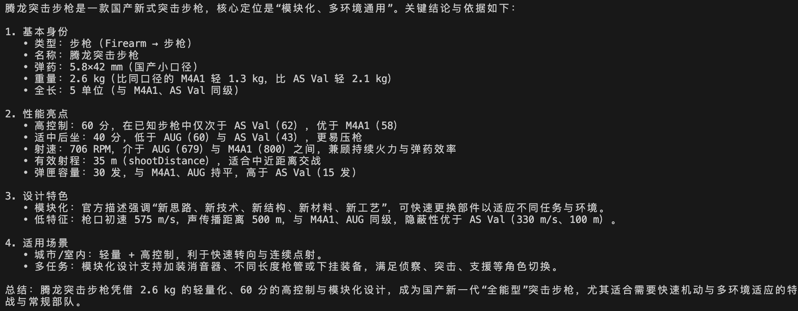
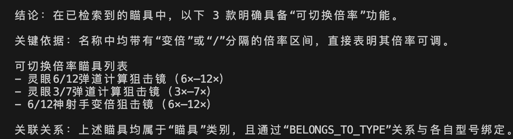
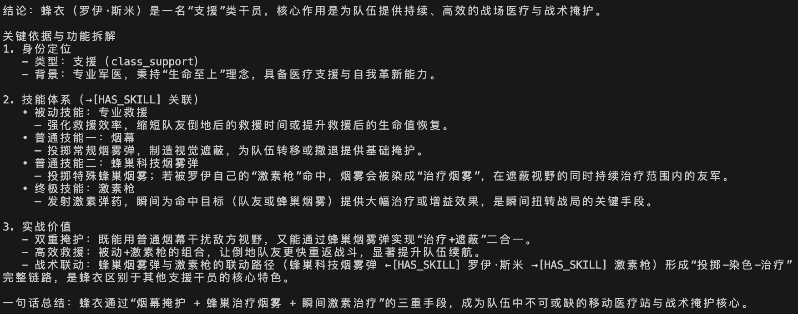
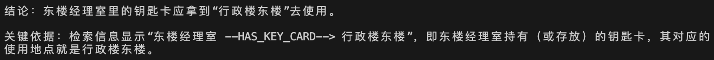

# DeltaForce_Agent
# 说明

个人学习所建项目，欢迎提建议，更新中！

目标：GraphRAG + Multi-Agent + SFT LoRA/QLoRA RLHF


# TODO

## 功能

- ☐ 三角洲知识问答助手
- ☐ 三角洲战备智能体（鼠鼠玩家、正常玩家、猛攻玩家）
- ☐ 三角洲改枪大师（你说需求，Agent根据数据给出改枪方案）
- ...


## 📦 开源三角洲图数据（DeltaForce_GraphData）

**路径：** `data/neo4j/`

- ✅ 地图相关（map.json）- 地图、区域、钥匙等
- ✅ 干员数据（operator.json）- 角色名称、技能等
- ✅ 收藏品（collection.json）- 类别、名称、品质、重量、大小等
- ✅ 装备数据（equipment.json）- 名称、重量、耐久度、容量、最大联通格数等
- ✅ 枪械数据（firearms.json）- 枪械、类型、基础数值等
- ✅ 配件数据（attachments.json）- 配件（弹匣、瞄具、护木、枪管等）名称、类型、效果等
- ✅ 弹药数据（ammo.json）- 弹药名称、类型等

## 其他

- ☐ 支持本地LLM模型调用
- ☐ 微调
- ☐ Post-Training
- ☐ LangChain 1.0 升级
- ...


---
# 当前版本

<details>
<summary><b> V0.1.1 - 知识库升级 </b></summary>

## 升级内容

- 丰富知识库数据：新增枪械、配件、弹药数据
- 优化数据处理脚本，支持多文件批量处理
- 数据总量：1391个节点，1836条关系

## Quick Start

### 1. 环境准备

```bash
# 安装依赖
cd rag_app
pip install -r requirements.txt

# 配置环境变量
cp .env.example .env
# 编辑 .env 文件，填入实际配置
```

### 2. 启动数据库

```bash
# 启动Neo4j
cd docker/neo4j
docker-compose up -d

# 启动Milvus
cd docker/milvus
docker-compose up -d
```

### 3. 运行系统

```bash
cd rag_app
python main.py
```

## 使用说明

启动后进入交互式问答模式：

- 直接输入问题进行提问
- `stats` - 查看系统统计
- `rebuild` - 重建知识库
- `quit` - 退出系统

## 样例展示

### 示例1：给我介绍一下腾龙突击步枪




### 示例2：有什么瞄具能够切换倍率的




## 技术栈

- Neo4j - 图数据库
- Milvus - 向量数据库
- BAAI/bge-small-zh-v1.5 - 嵌入模型
- Kimi API - 大语言模型

</details>

---

<details>
<summary><b> V0.1.0 </b></summary>

## DeltaForce GraphRAG知识问答系统

基础版本，包含地图、干员、收藏品、装备数据。

## 样例展示

### 示例1：蜂衣有什么用



### 示例2：东楼经理室在哪用



## 技术栈

- Neo4j - 图数据库
- Milvus - 向量数据库
- BAAI/bge-small-zh-v1.5 - 嵌入模型
- Kimi API - 大语言模型

</details>


