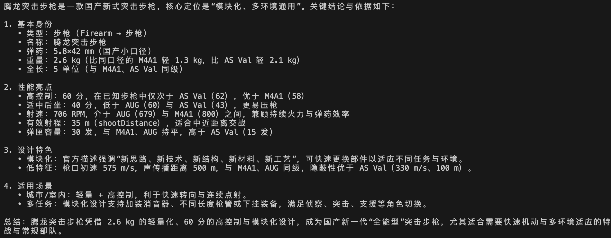
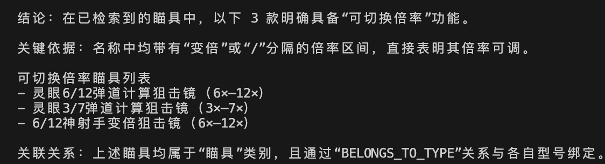
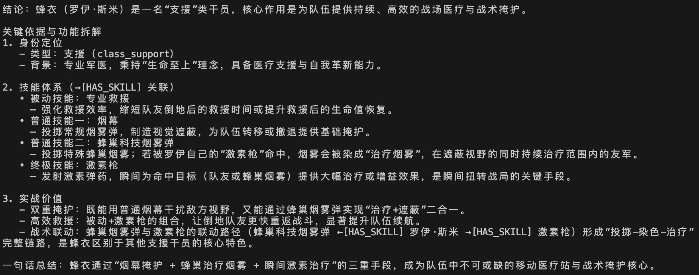
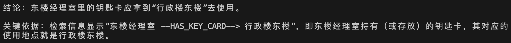

# DeltaForce_Agent
# 说明

个人学习所建项目，欢迎提建议，更新中！

目标：GraphRAG + Multi-Agent + SFT LoRA/QLoRA RLHF


# TODO

## 功能

- ✅ 三角洲知识问答助手
- ☐ 三角洲战备智能体（鼠鼠玩家、正常玩家、猛攻玩家）
- ☐ 三角洲改枪大师（你说需求，Agent根据数据给出改枪方案）
- ...


## 📦 开源三角洲图数据（DeltaForce_GraphData）

**路径：** `data/neo4j/`

- ✅ 地图相关（map.json）- 地图、区域、钥匙等
- ✅ 干员数据（operator.json）- 角色名称、技能等
- ✅ 收藏品（collection.json）- 类别、名称、品质、重量、大小等
- ✅ 装备数据（equipment.json）- 名称、重量、耐久度、容量、最大联通格数等
- ✅ 枪械数据（firearms.json）- 枪械、类型、基础数值等
- ✅ 配件数据（attachments.json）- 配件（弹匣、瞄具、护木、枪管等）名称、类型、效果等
- ✅ 弹药数据（ammo.json）- 弹药名称、类型等

## 其他

- ☐ 支持本地LLM模型调用
- ☐ 微调
- ☐ Post-Training
- ✅ LangChain 1.0 升级
- ...

## 已实现功能

- 多智能体主流程：主Agent调度 + 子Agent协作（意图识别、任务规划、执行、专业分析、总结）。
- 图RAG知识问答：支持地图、干员、收藏品、装备、枪械、配件、弹药等知识检索与生成（1379个实体，1837个关系）。
- 市场分析工具链（工具实现已开源）：
  - 最新价格查询
  - 历史价格查询
  - 买卖建议分析（结合区间位置与持仓成本）
  - 特勤处制造利润榜（分组 Top1/Top3）
  - 多物品价格对比
  - 利润稳定性分析
  - 综合回答编排（资料 + 价格 + 建议）
- 离线数据工程能力：Neo4j/Milvus 建库、重建、CSV/Cypher 导出、数据管道脚本。

功能的调用方式与示例请查看：`docs/USAGE_GUIDE.md`

## 关于实时数据

当前开源仓库暂未开源实时市场数据获取的具体实现方式。  
如有接入需求，欢迎提 Issue 说明场景；也可以通过其他协作方式获取实时数据接入支持。


---
# 当前版本

<details open>
<summary><b> V0.3.0 - 主Agent + 子Agent 编排</b></summary>

## 升级内容

- 多智能体流程升级为主Agent调度 + 子Agent协作（LangGraph A2A）。
- 新增节点分工：`main_orchestrator -> intent_recognition -> (task_planning) -> execution -> (specialist_analysis) -> summary`。
- 将复杂问题与专业分析流程按需触发，简单问题走轻路径，降低不必要的调用开销。
- 文档补充：新增/更新 `docs/USAGE_GUIDE.md`，覆盖功能清单、底层调用和可复现示例。

## Multi-Agent 逻辑

- 主流程调度：`src/agents/main_orchestrator.py`
- 意图识别：`src/agents/intent_recognition.py`
- 任务规划（复杂问题）：`src/agents/task_planning.py`
- 工具执行：`src/agents/execution_agent.py`
- 专业分析（按需触发）：`src/agents/specialist_analysis.py`
- 总结输出：`src/agents/summary_agent.py`
- 图编排定义：`src/agents/graph.py`

## 运行

```bash
pip install -r requirements.txt
cp .env.example .env
python main.py
```


</details>

---

<details>
<summary><b> V0.2.0 - 工程结构重整 + Agent工具化 </b></summary>

## 升级内容

- 项目目录调整为标准结构：`main.py`、`config.py`、`src/`、`data/`、`docker/`、`docs/`
- 将 RAG 封装为可调用能力，接入工具层与 Agent 路由流程
- 根入口改为 `main.py`，默认运行 LangGraph Multi-Agent（意图识别后路由到工具）
- RAG build/serve/rebuild 调试入口统一放到 `src/rag_modules/rag_system.py`
- 新增统一数据脚本：`data/scripts/data_pipeline.py`
- 合并旧数据脚本能力（统计、导出、导入、清库、重建）
- 清理旧兼容目录和重复脚本，减少维护成本

## Quick Start

### 1. 环境准备

```bash
# 安装依赖
pip install -r requirements.txt

# 配置环境变量
cp .env.example .env
# 编辑 .env 文件，填入实际配置
```

### 2. 启动数据库

```bash
# 启动Neo4j
cd docker/neo4j
docker-compose up -d

# 启动Milvus
cd docker/milvus
docker-compose up -d
```

### 3. 运行系统

```bash
# 默认：Multi-Agent 模式（intent -> route -> tool）
python main.py

# RAG子系统调试模式
RAG_RUN_MODE=build PYTHONPATH=src python -m rag_modules.rag_system
RAG_RUN_MODE=serve PYTHONPATH=src python -m rag_modules.rag_system
RAG_RUN_MODE=rebuild PYTHONPATH=src python -m rag_modules.rag_system
```

### 4. 数据处理

```bash
python data/scripts/data_pipeline.py --help
python data/scripts/data_pipeline.py stats
python data/scripts/data_pipeline.py export-csv
```

## 使用说明

- `RAG_RUN_MODE=build`：离线建库
- `RAG_RUN_MODE=serve`：在线问答
- `RAG_RUN_MODE=rebuild`：重建向量索引
- `RAG_RUN_MODE=agent`：Multi-Agent 模式（默认）

</details>

---

<details>
<summary><b> V0.1.1 - 知识库升级 </b></summary>

## 升级内容

- 丰富知识库数据：新增枪械、配件、弹药数据
- 优化数据处理脚本，支持多文件批量处理
- 数据总量：1391个节点，1836条关系

## Quick Start

### 1. 环境准备

```bash
# 安装依赖
cd rag_app
pip install -r requirements.txt

# 配置环境变量
cp .env.example .env
# 编辑 .env 文件，填入实际配置
```

### 2. 启动数据库

```bash
# 启动Neo4j
cd docker/neo4j
docker-compose up -d

# 启动Milvus
cd docker/milvus
docker-compose up -d
```

### 3. 运行系统

```bash
cd rag_app
python main.py
```

## 使用说明

启动后进入交互式问答模式：

- 直接输入问题进行提问
- `stats` - 查看系统统计
- `rebuild` - 重建知识库
- `quit` - 退出系统

## 样例展示

### 示例1：给我介绍一下腾龙突击步枪




### 示例2：有什么瞄具能够切换倍率的




## 技术栈

- Neo4j - 图数据库
- Milvus - 向量数据库
- BAAI/bge-small-zh-v1.5 - 嵌入模型
- Kimi API - 大语言模型

</details>

---

<details>
<summary><b> V0.1.0 </b></summary>

## DeltaForce GraphRAG知识问答系统

基础版本，包含地图、干员、收藏品、装备数据。

## 样例展示

### 示例1：蜂衣有什么用



### 示例2：东楼经理室在哪用



## 技术栈

- Neo4j - 图数据库
- Milvus - 向量数据库
- BAAI/bge-small-zh-v1.5 - 嵌入模型
- Kimi API - 大语言模型

</details>


---
