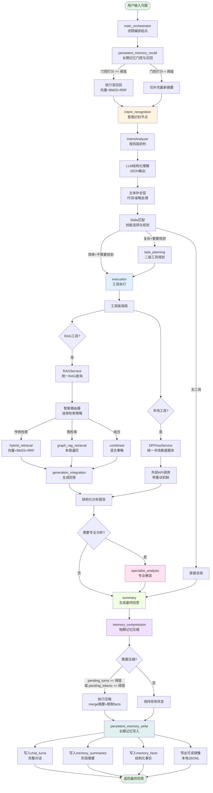
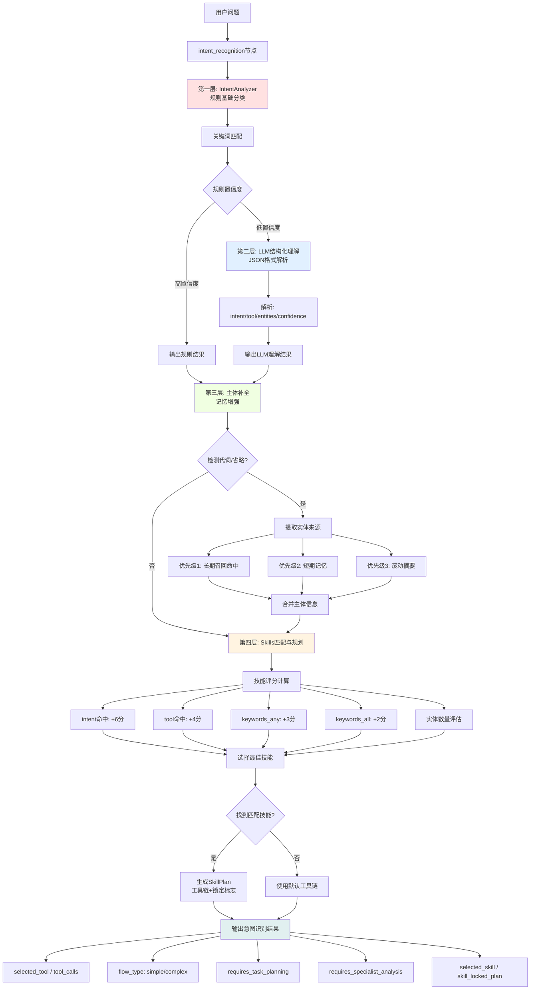
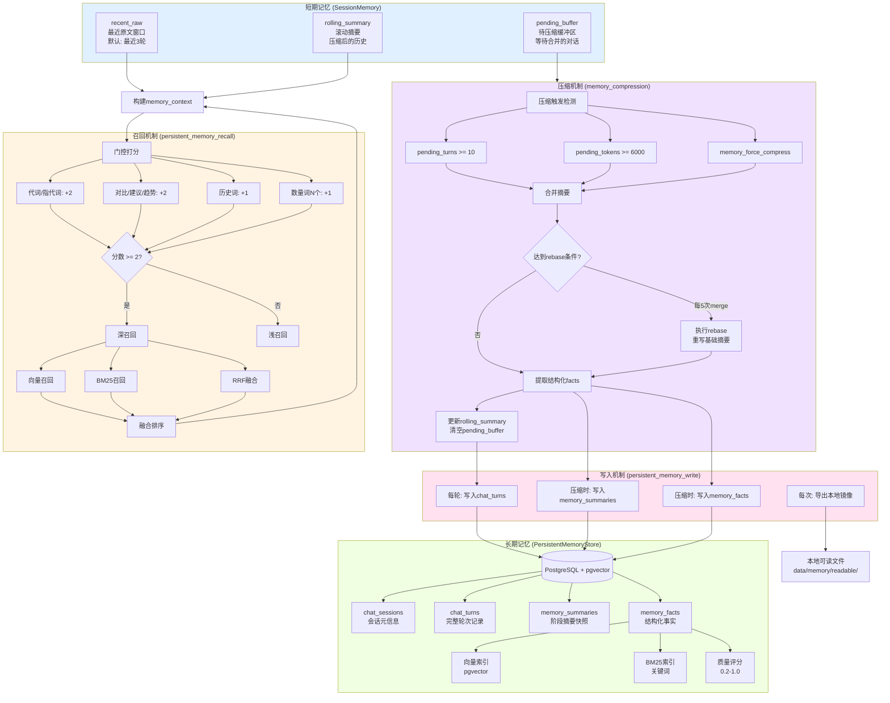
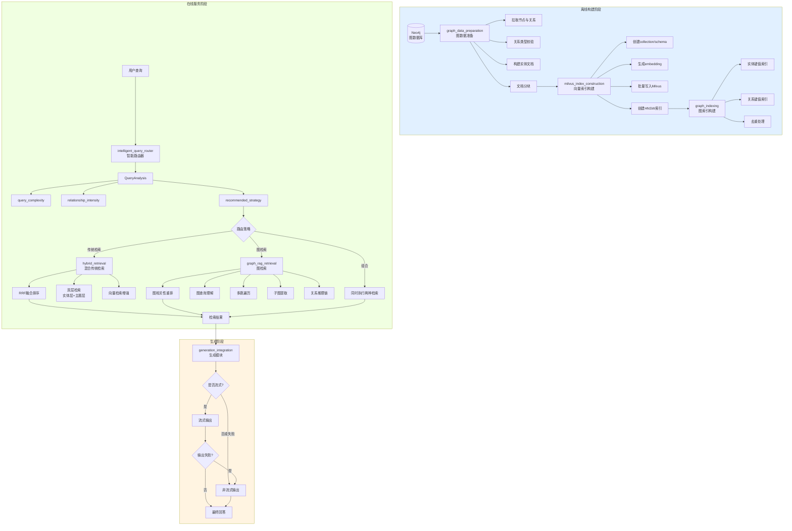
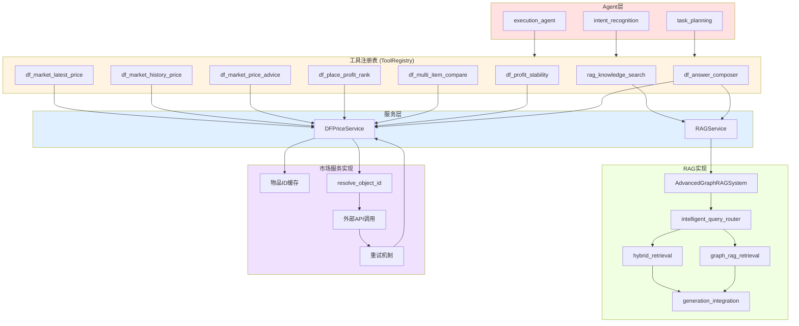
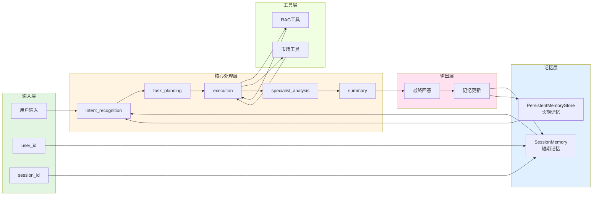

# Delta Agent 系统架构图集

## 1. 主流程图（完整版）



---

## 2. 意图识别详细流程图



---

## 3. 记忆系统架构图



---

## 4. GraphRAG 子系统架构图



---

## 5. Skills 工具编排图

```mermaid
flowchart LR
    subgraph DEFINITIONS["技能定义 (definitions/*.json)"]
        S1[knowledge_profile]
        S2[market_latest_price]
        S3[market_history_price]
        S4[market_price_advice]
        S5[market_multi_item_compare]
        S6[place_profit_rank]
        S7[profit_stability]
        S8[answer_composer]
    end

    subgraph REGISTRY["Skills注册表"]
        SCORE[评分计算器]
        PLAN[计划生成器]
    end

    DEFINITIONS --> REGISTRY

    subgraph INPUTS["输入信号"]
        I1[intent]
        I2[selected_tool]
        I3[entities]
        I4[query_keywords]
    end

    INPUTS --> SCORE

    SCORE --> CALC[技能匹配评分]
    CALC --> C1[intent_hints: +6]
    CALC --> C2[tool_hints: +4]
    CALC --> C3[query_keywords_any: max+3]
    CALC --> C4[query_keywords_all: +2]
    CALC --> C5[实体数量评估]

    C1 --> TOTAL[总分计算]
    C2 --> TOTAL
    C3 --> TOTAL
    C4 --> TOTAL
    C5 --> TOTAL

    TOTAL --> SELECT[选择最佳技能]
    SELECT --> CONFIDENCE[计算置信度<br/>min(0.99, score/12.0)]

    CONFIDENCE --> THRESHOLD{置信度 >= 阈值?}
    THRESHOLD -->|是| MATCH[匹配成功]
    THRESHOLD -->|否| FALLBACK[降级到通用技能]

    MATCH --> PLAN
    FALLBACK --> PLAN

    PLAN --> OUTPUT[SkillPlan]
    OUTPUT --> OP1[tool_chain: 工具链]
    OUTPUT --> OP2[locked: 是否锁定]
    OUTPUT --> OP3[requires_task_planning]
    OUTPUT --> OP4[requires_specialist_analysis]

    subgraph EXECUTION["执行路径"]
        LOCKED{locked?}
        LOCKED -->|是| DIRECT[直接使用工具链]
        LOCKED -->|否| TASK_PLANNING[进入task_planning<br/>LLM二次规划]
        TASK_PLANNING --> DIRECT
    end

    OP2 --> EXECUTION

    style DEFINITIONS fill:#e1f0ff
    style REGISTRY fill:#f0ffe1
    style INPUTS fill:#fff4e1
    style EXECUTION fill:#ffe1f0
```

---

## 6. 工具与服务调用链图



---

## 7. 数据流向图



---

## 使用说明

以上图表可以从不同视角展示系统架构：

1. **主流程图** - 完整展示从用户输入到最终输出的全链路
2. **意图识别详细流程** - 展示四层意图识别机制
3. **记忆系统架构** - 展示短期和长期记忆的完整设计
4. **GraphRAG子系统** - 展示离线构建和在线服务的完整流程
5. **Skills工具编排** - 展示技能匹配和执行路径
6. **工具与服务调用链** - 展示从Agent到服务的调用层级
7. **数据流向图** - 展示数据在各层之间的流动

这些图表可以与 TECHNICAL_ARCHITECTURE.md 配合使用，提供更直观的系统理解。
