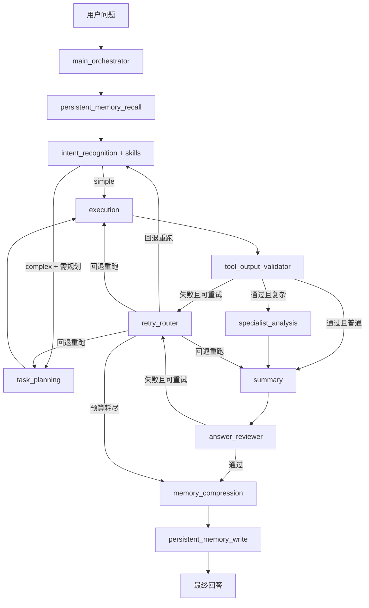

# Delta Agent 技术架构文档（Architecture & Implementation）

## 1. 文档目标
本文档面向工程实现，完整说明 `DeltaForceAgent` 项目的：
- 整体架构与核心技术选型
- 各子系统职责与实现方式
- 从用户输入到最终回答的全链路流程
- 长短期记忆、工具调用、RAG 检索、Skills 编排的协作机制
- 可扩展点与工程实践建议

> 说明：本文档以 `DeltaForceAgent` 仓库为准。实时价格相关能力仅描述“统一市场数据服务接口”的工程实现方式，不展开具体数据源细节。

---

## 2. 项目定位
`DeltaForceAgent` 是一个面向游戏知识与市场分析场景的 Multi-Agent 系统，核心目标：
- 用图RAG做高质量知识检索与问答
- 用工具链做价格/利润/对比/建议类分析
- 用短期 + 长期记忆支撑多轮连续对话
- 用 Skills 将“意图识别 -> 工具链路”标准化，降低误路由
- 用“工具输出审查 + 回答审查 + 退回重试”机制提升稳定性与结果质量

---

## 2.1 架构总览（框架设计）

本节聚焦三个核心问题：
- 意图识别如何实现
- 多个子 Agent 如何协作
- 主流程如何在简单链路与复杂链路之间做路由决策

### 2.1.1 主体框架：主Agent调度 + 子Agent分工
系统采用**状态图编排**，本质是一个有向图工作流：
- 主调度节点：`main_orchestrator`
- 功能子节点：`persistent_memory_recall`、`intent_recognition`、`task_planning`、`execution`、`tool_output_validator`、`specialist_analysis`、`summary`、`answer_reviewer`、`retry_router`、`memory_compression`、`persistent_memory_write`

框架特征：
- 单次请求在同一个 `AgentState` 上逐节点推进
- 每个节点只做“单一职责”处理并返回增量字段
- 节点间通过 `agent_messages` + 状态字段协作，不共享隐式全局变量

### 2.1.2 意图识别设计：规则 + LLM + 记忆补全 + Skills
意图识别由 `intent_recognition` 节点统一完成，核心是四层决策：

1. **基础规则层（IntentAnalyzer）**
- 基于关键词规则进行快速初判，得到基础 intent/tool 候选
- 提供稳定回退机制，避免单次模型波动导致链路失效

2. **LLM 结构化理解层**
- 对问题做 JSON 化理解，输出 `intent/tool/entities/confidence`
- 用于提升语义理解能力，尤其是复合问句

3. **主体补全层（记忆增强）**
- 处理“它/这两个/刚才那个”这类省略表达
- 从短期记忆、滚动摘要、长期召回命中中抽取实体补全
- 确保后续工具获得可执行的主体参数

4. **Skills 规划层**
- 基于 `skills/definitions/*.json` 做技能匹配
- 产出 `SkillPlan`（工具链、是否锁定）
- 决定是否需要 `task_planning` 二次规划

最终产物：
- `selected_tool` / `tool_calls`
- `flow_type`（simple/complex）
- `requires_task_planning`
- `requires_specialist_analysis`
- `selected_skill`、`skill_locked_plan` 等技能字段

### 2.1.3 子Agent协作机制：A2A + 条件路由
子 Agent 并非相互直接调用，而是由图编排层统一调度：

- 固定前置链路：
  - `main_orchestrator -> persistent_memory_recall -> intent_recognition`

- 条件分流 1（意图后）：
  - 有工具且复杂且需要规划：走 `task_planning`
  - 否则直接走 `execution`

- 条件分流 2（执行后审查）：
  - `execution` 后先进入 `tool_output_validator`
  - 若审查失败且可重试：进入 `retry_router` 回退到 `task_planning` 或 `execution`
  - 若审查通过：复杂场景进入 `specialist_analysis`，其余进入 `summary`

- 条件分流 3（回答后审查）：
  - `summary` 后进入 `answer_reviewer`
  - 若回答审查失败且可重试：进入 `retry_router` 回退到 `task_planning` 或 `summary`
  - 若回答审查通过：进入记忆链路

- 固定后置链路：
  - `memory_compression -> persistent_memory_write`

协作数据载体：
- `AgentState`：标准化状态字段（工具计划、执行结果、记忆上下文、技能命中等）
- `agent_messages`：节点间可追踪的消息轨迹（便于调试和测试）

### 2.1.4 设计原则与工程收益
这样拆分的工程收益：
- **稳定性**：规则兜底 + LLM增强，不会因单点模型波动完全失效
- **可扩展性**：新增能力通常只需加节点/加技能定义，不改主流程骨架
- **可观测性**：每一步都有状态与消息，可定位“路由错、实体错、工具错”的具体节点
- **可替换性**：intent/planning/specialist/summary/memory 节点都可独立换模型

---

## 3. 技术栈与作用

### 3.1 Agent 与编排
- `LangGraph`：定义主流程图（节点 + 条件路由）
- `LangChain`：模型调用、工具封装、文档对象与统一接口

### 3.2 RAG 与检索
- `Neo4j`：图数据存储（实体、关系）
- `Milvus`：向量索引（HNSW + COSINE）
- `BM25`：关键词检索
- `RRF`：多路召回融合（向量 + BM25 + 结构检索）

### 3.3 记忆系统
- 短期记忆：进程内会话记忆（recent/pending/summary）
- 长期记忆：`PostgreSQL + pgvector`
  - 全量可回滚对话存储
  - 结构化事实存储
  - 向量语义召回 + BM25 + RRF 融合

### 3.4 工具与服务
- `ToolRegistry`：统一注册工具
- `DFPriceService`：统一市场数据服务调用层
- `RAGService`：统一 RAG 查询服务层

### 3.5 模型
- 统一使用兼容 OpenAI 协议的 ChatModel 接口
- 按节点可切模型（intent/planner/specialist/summary/memory）

---

## 4. 目录结构（按职责）

```text
/data/DeltaForceAgent
├─ main.py                     # 系统入口
├─ config.py                   # 全局配置（非敏感）
├─ .env                        # 密钥与敏感配置
├─ src/
│  ├─ agents/                  # 多Agent节点
│  ├─ memory/                  # 长短期记忆系统
│  ├─ rag_modules/             # GraphRAG 子系统
│  ├─ retrieval/               # 融合检索工具
│  ├─ services/                # RAG/市场服务封装
│  ├─ skills/                  # Skills 定义与选择逻辑
│  └─ tools/                   # LangChain 工具实现
├─ data/
│  ├─ neo4j/                   # 图数据源
│  ├─ scripts/                 # 数据与测试脚本
│  ├─ benchmarks/              # A/B 测试样例集
│  └─ memory/                  # 本地可视化记忆导出
└─ docs/                       # 使用文档、测试报告、指标报告
```

---

## 5. 系统总架构



该流程由 `src/agents/graph.py` 组装，属于“主Agent调度 + 子Agent执行”的有状态图流程。

---

## 6. 主流程详细实现

### 6.1 启动入口
- 文件：`main.py`
- 行为：
  1. 加载 `.env`
  2. 注入 `src` 路径
  3. 读取 `DEFAULT_CONFIG`
  4. 启动 `run_agent_interactive`

### 6.2 运行时对象
- 文件：`src/agents/runner.py`
- `QueryRuntime` 包含：
  - `registry`: 工具注册中心
  - `persistent_store`: 长期记忆存储
  - `graph`: LangGraph 编排图
- 支持交互命令：
  - `new session`
  - `switch user <id>`
  - `memory stats`
  - `clear memory`
  - `quit`（退出前会做会话记忆归档）

### 6.3 状态模型（AgentState）
- 文件：`src/agents/state.py`
- 核心字段分组：
  - 基础会话：`user_id`, `session_id`, `user_query`
  - 路由决策：`intent`, `flow_type`, `selected_tool`, `tool_calls`
  - Skills：`selected_skill`, `skill_confidence`, `skill_tool_chain`, `skill_locked_plan`
  - 执行结果：`tool_results`, `analysis_report`, `final_answer`
  - 审查与重试：`validation_result`, `review_result`, `retry_count_total`, `retry_count_by_stage`, `retry_trace`, `retry_budget_exhausted`
  - 质量门：`quality_score`, `quality_gate_passed`, `block_persistent_write`
  - 记忆：短期记忆字段 + 长期召回字段 + 提取的 `memory_fact_candidates`

---

## 7. 各 Agent 节点职责与实现

### 7.1 `main_orchestrator`
- 文件：`src/agents/main_orchestrator.py`
- 职责：流程起点，写入编排元信息，向后续节点广播“开始处理”消息。

### 7.2 `persistent_memory_recall`
- 文件：`src/memory/persistent_memory_recall_node.py`
- 职责：长期记忆门控与召回。
- 门控打分（规则）：
  - 代词/指代词：+2
  - 对比/建议/趋势等复杂词：+2
  - 历史词：+1
  - “N个”数量词：+1
- 当分数达到阈值（`memory_persistent_trigger_threshold`）时：
  - 执行长期深召回（向量 + BM25 + RRF）
- 未达到阈值：
  - 仅补充长期记忆最新摘要

### 7.3 `intent_recognition`
- 文件：`src/agents/intent_recognition.py`
- 职责：统一完成“意图识别 + 主体识别 + 初始工具决策 + Skills 选择”。
- 核心机制：
  - 规则分析（`IntentAnalyzer`）
  - LLM结构化理解（JSON输出）
  - 主体补全（含代词场景，从短期/长期记忆补主体）
  - 输出 `tool_calls`、`flow_type`、`requires_task_planning` 等

### 7.4 `task_planning`
- 文件：`src/agents/task_planning.py`
- 职责：复杂问题下做二级工具规划。
- 触发条件：
  - `requires_task_planning=True`
  - 且 `skill_locked_plan=False`
- 额外能力：
  - 对比较工具自动补全标准化 query（避免“这两个物品”无实体失败）

### 7.5 `execution`
- 文件：`src/agents/execution_agent.py`
- 职责：执行工具链并生成结构化分析报告。
- 输出结构：
  - `facts`, `recommendations`, `risks`
  - `used_tools`, `successful_tools`, `failed_tools`
  - `skill`命中信息（skill_id/reason/confidence）

### 7.6 `specialist_analysis`
- 文件：`src/agents/specialist_analysis.py`
- 职责：对复杂分析类问题增加专业解读层。
- 失败回退：LLM异常时使用启发式策略输出关键洞察。

### 7.7 `summary`
- 文件：`src/agents/summary_agent.py`
- 职责：对外输出最终回答。
- 策略：
  - simple：尽量直出工具结果
  - complex：基于 `analysis_report` 做总结生成

### 7.8 `memory_compression`
- 文件：`src/memory/memory_compression_agent.py`
- 职责：维护短期记忆窗口、触发压缩、提取长期事实候选。

### 7.9 `persistent_memory_write`
- 文件：`src/memory/persistent_memory_write_node.py`
- 职责：将本轮完整对话、摘要、事实写入长期库并生成本地可读镜像。
- 质量保护：当 `block_persistent_write=True` 时，跳过写入，避免低质量结果污染长期记忆。


### 7.10 `tool_output_validator` / `answer_reviewer` / `retry_router`
- 文件：
  - `src/agents/tool_output_validator.py`
  - `src/agents/answer_reviewer.py`
  - `src/agents/retry_router.py`
- 职责：构建质量门与退回重试闭环。

实现要点：
- `tool_output_validator`
  - 校验工具结果结构、失败类型、可重试性
  - 区分“可重试执行失败”和“需重规划主体/参数失败”
- `answer_reviewer`
  - 校验最终回答完整性、一致性、对比实体解析结果
  - 失败时输出修正提示（hints）并触发回退
- `retry_router`
  - 统一管理总重试预算与分阶段预算
  - 决定回退目标（`intent_recognition/task_planning/execution/summary`）
  - 预算耗尽时降级输出并阻断低质量持久化写入

---

## 8. Skills 机制

### 8.1 目标
将“问题类型 -> 工具链路”配置化，降低硬编码分支和误路由。

### 8.2 数据模型
- 文件：`src/skills/models.py`
- 核心字段：
  - `intent_hints`
  - `tool_hints`
  - `query_keywords_any/all`
  - `default_chain`
  - `flow_type`
  - `requires_task_planning`
  - `requires_specialist_analysis`
  - `locked_plan`

### 8.3 选择逻辑
- 文件：`src/skills/registry.py`
- 打分来源：
  - intent 命中
  - tool 命中
  - 关键词命中
  - 实体数量/比较目标数量
- 产出：
  - `SkillSelection`
  - `SkillPlan`（工具链 + 是否锁定计划）

### 8.4 技能定义
- 路径：`src/skills/definitions/*.json`
- 当前技能包括：
  - `knowledge_profile`
  - `market_latest_price`
  - `market_history_price`
  - `market_price_advice`
  - `market_multi_item_compare`
  - `place_profit_rank`
  - `profit_stability`
  - `answer_composer`

---

## 9. 工具层与服务层

### 9.1 ToolRegistry
- 文件：`src/tools/registry.py`
- 职责：统一注册并暴露工具，Agent 只依赖 registry，不直接依赖底层服务。

### 9.2 RAG 工具
- 文件：`src/tools/rag_knowledge_tool.py`
- 工具名：`rag_knowledge_search`
- 调用链：Tool -> `RAGService.query` -> GraphRAG 路由检索 -> 生成答案

### 9.3 市场分析工具族
- 文件：`src/tools/df_price_tools.py`
- 能力：
  - 最新价格
  - 历史价格
  - 买卖建议
  - 制造利润榜（含分组Top1/Top3）
  - 多物品对比
  - 利润稳定性
  - 综合回答编排（知识 + 市场 +建议）

### 9.4 市场服务调用层
- 文件：`src/services/df_price_service.py`
- 实现要点：
  - 统一请求头与超时管理
  - 多候选路径重试
  - 物品ID解析与缓存（`resolve_object_id`）
  - 统一成功/失败结构返回

> 该层对外统一暴露市场数据服务接口，工具层不直接暴露底层数据源细节。

---

## 10. GraphRAG 子系统实现细节

### 10.1 系统封装
- 文件：`src/services/rag_service.py`
- 特点：懒加载启动（首问时初始化），统一对外 `query()`。

### 10.2 RAG 主控
- 文件：`src/rag_modules/rag_system.py`
- 关键模式：
  - `build`：离线建库
  - `serve`：在线加载已有索引
  - `rebuild`：重建索引
  - `agent`：多Agent入口模式
- 关键流程：
  1. 图数据加载
  2. 文档构建与分块
  3. 向量索引构建/加载
  4. 初始化传统检索 + 图检索 + 路由器
  5. 路由检索并生成回答

### 10.3 图数据准备
- 文件：`src/rag_modules/graph_data_preparation.py`
- 能力：
  - 从 Neo4j 拉取节点与关系
  - 关系类型校验（标准化后校验）
  - 构建实体文档（属性 + 邻接关系）
  - 文档分块（固定块 / section 分块）

### 10.4 Milvus 索引构建
- 文件：`src/rag_modules/milvus_index_construction.py`
- 能力：
  - collection/schema/index 创建
  - embedding 生成与批量写入
  - 行数校验、flush/load
  - 相似度搜索

### 10.5 智能路由
- 文件：`src/rag_modules/intelligent_query_router.py`
- 输出：`QueryAnalysis`
  - query_complexity
  - relationship_intensity
  - recommended_strategy
- 策略：
  - `hybrid_traditional`
  - `graph_rag`
  - `combined`

### 10.6 传统混合检索
- 文件：`src/rag_modules/hybrid_retrieval.py`
- 组合：
  - 双层检索（实体层 + 主题层）
  - 向量检索增强
  - RRF 融合排序

### 10.7 图RAG检索
- 文件：`src/rag_modules/graph_rag_retrieval.py`
- 能力：
  - 图查询理解（实体、关系类型、深度）
  - 多跳遍历
  - 子图提取
  - 关系推理链生成
  - 图相关性重排

### 10.8 生成模块
- 文件：`src/rag_modules/generation_integration.py`
- 能力：
  - 非流式自适应回答
  - 流式输出 + 重试 + 降级

---

## 11. 记忆系统（短期 + 长期）

### 11.1 短期记忆（SessionMemory）
- 文件：`src/memory/session_memory.py`
- 结构：
  - `recent_raw`：最近原文窗口
  - `pending_buffer`：待压缩缓冲
  - `rolling_summary`：滚动摘要
- 上下文拼接：
  - `[历史摘要] + [待压缩摘要] + [最近对话]` -> `memory_context`

### 11.2 短期压缩策略
- 文件：`src/memory/memory_compression_agent.py`
- 触发条件：
  - `pending_turns >= memory_pending_turns_trigger`
  - 或 `pending_tokens >= memory_pending_tokens_trigger`
  - 或 `memory_force_compress=True`
- 压缩动作：
  1. 合并摘要
  2. 可选 rebase（每 N 次 merge）
  3. 提取 keywords/facts 候选
  4. 清空 pending，更新 rolling summary

### 11.3 长期记忆存储模型
- 文件：`src/memory/persistent_memory_store.py`
- 核心表：
  - `chat_sessions`：会话元信息
  - `chat_turns`：完整轮次（user/assistant/tool）
  - `memory_summaries`：阶段摘要快照
  - `memory_facts`：结构化可复用事实（含 embedding）
- 关键索引：
  - `(user_id, session_id, turn_index)`
  - `memory_summaries(user_id, session_id, source_turn_end)` 唯一
  - `memory_facts(user_id, session_id, fact_key)` 等检索索引

### 11.4 长期召回算法
- 文件：`src/memory/persistent_memory_store.py`
- 流程：
  1. 向量召回（pgvector）
  2. BM25 召回（关键词）
  3. RRF 融合（`retrieval/fusion.py`）
  4. 提取实体、拼接长期上下文

### 11.5 长期写入策略
- 文件：`src/memory/persistent_memory_write_node.py`
- 每轮写入：
  - `chat_turns`（完整对话 + 工具输出）
- 压缩触发时额外写入：
  - `memory_summaries`
  - `memory_facts`
- 本地可视化：
  - `data/memory/readable/<user>/<session>/memory_events.jsonl`
  - `memory_readable.md`

---

## 12. 用户与会话管理

实现位置：`src/agents/runner.py` + `src/memory/session_memory.py`

- `user_id` + `session_id` 是全链路主键：
  - 短期记忆隔离
  - 长期记忆隔离
  - 召回隔离
- 命令级管理：
  - `switch user <id>`：切换用户并新建会话
  - `new session`：同用户新会话
  - `clear memory`：清空当前会话短期记忆
  - `memory stats`：查看当前会话内存状态

---

## 13. 配置系统设计

- 配置文件：`config.py`
  - 存放可公开、可版本化的系统参数
- 环境变量：`.env`
  - 存放密钥、密码、DSN 等敏感配置

关键配置分组：
- 运行模式：`run_mode`
- 数据库：Neo4j / Milvus
- LLM：主模型 + 节点模型
- 检索：`top_k`, 融合权重, `rrf_k`
- 记忆：短期阈值、长期召回参数
- 市场工具：统一服务接口参数

---

## 14. 工程验证与测试体系

### 14.1 统一全量测试脚本
- 文件：`data/scripts/system_full_metrics_suite.py`
- 覆盖范围：
  - 单轮基准（意图/工具/技能/实体/回答）
  - 多轮基准（代词、省略、对比）
  - 全工具集成会话（知识、价格、历史、建议、利润、对比、综合回答）
  - 跨会话重入
  - `user_id` 隔离
  - 长短期记忆（门控、召回、压缩、持久化）
  - 审查与重试链路
  - 故障注入样本（强制一次工具 5xx，验证退回重试）

### 14.2 指标框架
- 文件：`docs/SYSTEM_METRICS_FRAMEWORK.md`
- 指标分层：
  - 核心效果：`intent_accuracy`、`tool_accuracy`、`entity_resolution_accuracy`、`single_turn_success_rate` 等
  - 知识库 RAG：`kb_rag_route_accuracy`、`kb_rag_entity_recall_proxy`、`kb_rag_success_rate` 等
  - 长期记忆 RAG：`ltm_gate_trigger_rate`、`ltm_recall_hit_rate`、`ltm_entity_resolution_accuracy` 等
  - 工程稳定性：`validator_reject_rate`、`reviewer_reject_rate`、`retry_invocation_rate`、`retry_budget_exhausted_rate` 等
  - 性能：`avg_latency_sec`、`p50_latency_sec`、`p95_latency_sec`

### 14.3 报告产物
- `docs/SYSTEM_FULL_METRICS_RESULT.json`
- `docs/SYSTEM_FULL_METRICS_REPORT.md`
- `docs/SYSTEM_FULL_METRICS_REPORT_BRIEF.md`

### 14.4 评测原则
- 统一脚本、统一样本、统一输出格式，避免口径漂移
- 将“功能正确性”和“工程稳定性”同时纳入验收
- 故障注入为常规测试项，用于持续验证重试链路可用性

## 15. 端到端执行流程（单次查询）

1. 用户输入问题（带 `user_id/session_id`）
2. 读取短期记忆并构建初始 `memory_context`
3. 长期记忆门控打分：
   - 达到阈值：执行深召回并拼接上下文
   - 未达到阈值：仅补充最新摘要
4. 意图识别 + 主体识别 + Skills 选择
5. 生成工具链（必要时进入 `task_planning` 进行二级规划）
6. 执行工具链并产出结构化结果
7. `tool_output_validator` 审查工具结果：
   - 失败且可重试：进入 `retry_router` 回退到 `task_planning` 或 `execution`
   - 通过：继续后续链路
8. 复杂问题进入 `specialist_analysis`
9. `summary` 节点生成最终回答
10. `answer_reviewer` 审查回答质量：
    - 失败且可重试：进入 `retry_router` 回退到 `task_planning` 或 `summary`
    - 通过：进入记忆写回
11. `memory_compression` 更新短期记忆，必要时触发压缩并提取 facts
12. `persistent_memory_write` 持久化完整轮次、摘要与 facts（质量门不通过时阻断写入）
13. 返回最终结果给用户

## 16. 可扩展设计点

### 16.1 新增工具
- 在 `src/tools/` 新建工具函数
- 在 `ToolRegistry` 注册
- 在 `IntentAnalyzer` / `SkillDefinition` 增加路由规则

### 16.2 新增 Skill
- 在 `src/skills/definitions/` 添加 JSON 定义
- 无需改动主流程图，自动接入选择逻辑

### 16.3 新增专业子Agent
- 在 `agents/graph.py` 增加节点与路由
- 在 `AgentState` 增加必要字段

### 16.4 记忆策略调整
- 通过 `config.py` 修改阈值：
  - `memory_recent_raw_limit`
  - `memory_pending_turns_trigger`
  - `memory_pending_tokens_trigger`
  - `memory_persistent_trigger_threshold`

---

## 17. 当前版本的工程特性总结

- 架构上：主Agent调度 + 子Agent分工清晰，并引入审查退回重试闭环
- 检索上：传统检索与图检索可按问题复杂度切换
- 记忆上：短期连续性 + 长期可回滚可召回
- 工具上：统一注册、统一调用、统一错误收敛
- 稳定性上：具备质量门、重试预算、失败降级与持久化写入保护
- 测试上：采用统一全量测试脚本，覆盖功能、指标与故障注入

当前实现已形成可持续演进的工程底座：新增能力以配置扩展与模块扩展为主，通常不需要重写主流程骨架。
