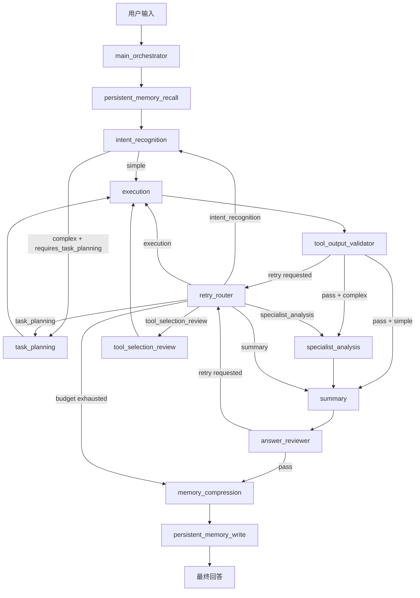

# DeltaForce_Agent 技术架构文档

## 1. 项目概述
`DeltaForce_Agent` 是一个面向《三角洲行动》知识问答与市场分析的多智能体系统。系统通过 LangGraph 编排主流程，结合知识库 RAG、长期记忆检索、工具链执行与质量审查，实现可解释、可回退、可评测的工程闭环。

核心能力：
- 多智能体协作编排（主流程调度 + 子节点单一职责）
- 双检索链路（知识库 GraphRAG + 长期记忆 RAG）
- 工具调用闭环（选择、执行、审查、重试）
- 本地/在线混合模型（Qwen3-8B + LoRA / Kimi）
- 系统级评测与阶段级可观测（SFT 离线评测 + 会话级 Benchmark）

---

## 2. 总体架构设计

### 2.1 设计原则
- 单一职责：每个节点仅处理一类问题并返回明确状态增量。
- 显式状态流：统一通过 `AgentState` 传递上下文，避免隐式共享状态。
- 失败可回退：失败时回退到最小必要阶段，不做全链路重跑。
- 模型可替换：意图识别、工具选择、任务规划、总结等节点均可独立替换模型。

### 2.2 主流程图（LangGraph）
实现文件：`src/agents/graph.py`

### 2.3 节点职责
| 节点 | 作用 | 关键输出 |
|---|---|---|
| `main_orchestrator` | 初始化元信息 | `orchestration_meta` |
| `persistent_memory_recall` | 长期记忆门控与召回 | `memory_persistent_*` |
| `intent_recognition` | 意图识别、实体补全、工具初选、技能命中 | `intent/selected_tool/tool_calls` |
| `task_planning` | 复杂任务二级规划 | `task_plan` |
| `tool_selection_review` | 异常链路工具复核/重选 | 修正 `tool_calls` |
| `execution` | 工具执行与结果收集 | `tool_results` |
| `tool_output_validator` | 工具结果质量审查 | `validation_result` |
| `specialist_analysis` | 复杂问题专业分析增强 | 分析结构化结果 |
| `summary` | 最终回答整合 | `final_answer` |
| `answer_reviewer` | 最终回答审查 | `review_result` |
| `retry_router` | 重试预算与回退阶段决策 | `retry_target_stage` |
| `memory_compression` | 短期记忆压缩与事实提取 | `rolling_summary/fact_candidates` |
| `persistent_memory_write` | 长期记忆持久化写入 | 数据库写入结果 |

---

## 3. 意图识别、工具选择与任务规划

### 3.1 意图识别（Intent Recognition）
实现文件：`src/agents/intent_recognition.py`

当前实现为“规则 + LLM + 记忆补全 + Skills”四层融合：
1. `IntentAnalyzer` 提供规则先验。
2. LLM 输出结构化 JSON。
3. 从短期/长期记忆补全省略主体（如“它”“这两个”）。
4. Skills 命中后注入工具链先验。

新增工程化增强：
- LLM 输出通过 Pydantic 做结构校验，避免脏 JSON 直接进入下游。
- Prompt 外置到 `src/prompts/intent_recognition_prompt.txt`，降低硬编码维护成本。

### 3.2 工具选择复核（Tool Selection Review）
实现文件：`src/agents/tool_selection_review.py`

该节点仅在异常重试路径触发：
- 当工具执行失败且被判定为“工具/参数问题”时，优先重选工具。
- 目标是缩短回退路径，避免每次退回到意图识别层全量重做。

### 3.3 复杂任务规划（Task Planning）
实现文件：`src/agents/task_planning.py`

- 仅在复杂流触发。
- 对多步骤任务进行工具链规划与参数标准化。
- 对比类问题自动补全 query，降低“代词/省略”导致的执行失败概率。

---

## 4. Skills 策略层

实现目录：`src/skills/*`

- 定义：`src/skills/definitions/*.json`
- 注册：`src/skills/registry.py`

作用：
- 将“问题类型 -> 工具链”规则配置化。
- 在高频任务中减少纯 prompt 决策波动。
- 为复杂问题提供稳定可复现的执行链。

---

## 5. 工具层与服务层

### 5.1 工具注册中心
实现文件：`src/tools/registry.py`

统一暴露工具：
- `rag_knowledge_search`
- `df_market_latest_price`
- `df_market_history_price`
- `df_market_price_advice`
- `df_place_profit_rank`
- `df_multi_item_compare`
- `df_profit_stability`
- `df_answer_composer`

### 5.2 市场服务抽象
实现文件：`src/services/df_price_service.py`

职责：
- 请求封装与超时控制
- 多候选路径重试
- 标准化成功/失败结构

### 5.3 输入安全与参数治理
实现文件：`src/tools/df_price_tools.py`

新增统一输入校验能力：
- `objectName` 白名单与长度约束
- `id/objectId` 数字格式约束
- 日期字段（`YYYY-MM-DD` 或时间戳）校验
- `place/type/top` 等枚举/范围约束

该策略用于降低异常参数、注入式输入、无效调用导致的失败率。

---

## 6. 双 RAG 架构

### 6.1 知识库 RAG（GraphRAG）
关键文件：
- `src/services/rag_service.py`
- `src/rag_modules/rag_system.py`
- `src/rag_modules/intelligent_query_router.py`
- `src/rag_modules/hybrid_retrieval.py`
- `src/rag_modules/graph_rag_retrieval.py`

能力：
- 图检索 + 向量检索 + BM25 混合
- 路由策略（`hybrid_traditional` / `graph_rag` / `combined`）
- 融合排序与答案生成

### 6.2 长期记忆 RAG（Persistent Recall）
关键文件：
- `src/memory/persistent_memory_store.py`
- `src/memory/persistent_memory_recall_node.py`

流程：
1. 门控打分
2. 向量召回（pgvector）
3. 关键词召回（BM25）
4. RRF 融合重排
5. 拼接长期记忆上下文

---

## 7. 记忆系统（短期 + 长期）

### 7.1 短期记忆
实现文件：`src/memory/session_memory.py`

结构：
- `recent_raw`：最近原文窗口
- `pending_buffer`：待压缩缓冲
- `rolling_summary`：滚动摘要
- `memory_context`：运行时拼接上下文

### 7.2 记忆压缩与事实提取
实现文件：`src/memory/memory_compression_agent.py`

触发条件（默认）：
- `pending_turns >= 4` 或 `pending_tokens >= 500`

### 7.3 长期持久化
实现文件：`src/memory/persistent_memory_store.py`

主要表：
- `chat_sessions`
- `chat_turns`
- `memory_summaries`
- `memory_facts`

新增工程化增强：
- PostgreSQL 连接超时配置化（`memory_persistent_connect_timeout_seconds`）
- 向量维度范围校验，避免错误配置导致运行时异常

---

## 8. 质量审查与重试机制

### 8.1 工具结果审查
实现文件：`src/agents/tool_output_validator.py`

判定维度：
- 工具执行是否成功
- 失败是否可重试
- 应回退到哪个阶段（执行/规划/工具复核/意图重识别）

### 8.2 回答审查
实现文件：`src/agents/answer_reviewer.py`

判定维度：
- 回答完整性
- 与工具证据一致性
- 最终质量门是否通过

### 8.3 重试路由
实现文件：`src/agents/retry_router.py`

机制：
- 总预算：`retry_max_total`
- 分阶段预算：`retry_max_<stage>`
- 支持回退目标：`intent_recognition/tool_selection_review/task_planning/execution/specialist_analysis/summary`

预算耗尽后：
- 输出可解释降级结果
- `block_persistent_write=True`，阻断低质量结果写入长期记忆

---

## 9. 模型架构与 LoRA-SFT 接入

### 9.1 在线与本地混合
配置文件：`config.py`

- 在线模型（Kimi）用于 RAG 生成与部分总结节点。
- 本地模型（Qwen3-8B）用于高频结构化任务。

### 9.2 本地运行时
实现文件：`src/agents/local_qwen_runtime.py`

能力：
- 基座模型单例加载
- 子任务按需切换 LoRA Adapter
- 支持 no-think 模式
- 进程退出自动清理
- 运行时缓存上限与显存回收

### 9.3 三模块 LoRA-SFT
默认 Adapter：
- Intent：`outputs/intent_sft/qwen3_8b_lora`
- Tool Selection：`outputs/tool_selection_sft/qwen3_8b_lora`
- Planning：`outputs/planning_sft/qwen3_8b_lora`

---

## 10. 配置治理

### 10.1 `config.py`
存放可版本化的非敏感配置：
- 模型路径与 LoRA 路径
- 记忆阈值
- 重试预算
- 工具参数
- 阶段追踪开关
- 卖出手续费（`sell_fee_rate`）

### 10.2 `.env`
存放敏感项：
- API Key
- 数据库密码 / DSN

---

## 11. 训练与评测体系

### 11.1 SFT 数据集
目录：`data/dataset/sft/`
- `intent/{train,dev,test}.jsonl`
- `tool_selection/{train,dev,test}.jsonl`
- `planning/{train,dev,test}.jsonl`

### 11.2 训练入口
- `training/intent_sft/train.py`
- `training/tool_selection_sft/train.py`
- `training/planning_sft/train.py`

### 11.3 离线评测
- `training/intent_sft/eval.py`
- `training/tool_selection_sft/eval.py`
- `training/planning_sft/eval.py`
- Kimi 对照：`data/scripts/eval_kimi_sft_modules.py`

报告：`docs/SFT_EVAL_REPORT.md`

---

## 12. 可观测性与 Benchmark

### 12.1 会话级 Benchmark
脚本：`data/scripts/system_conversation_benchmark_suite.py`

支持：
- 多轮会话评测
- 多模型对比（`kimi/base_qwen3_8b/qwen3_8b_lora`）
- 多指标自动汇总

### 12.2 阶段级观测
- `AGENT_STAGE_TRACE_ENABLED`
- `orchestration_meta.stage_timings_ms`
- `debug_steps`

---

## 13. 端到端执行流程
1. 用户输入（`user_id/session_id`）
2. 读取短期记忆并构建上下文
3. 长期记忆门控与召回
4. 意图识别 + 实体补全 + 工具初选 + Skills
5. 复杂任务进入 `task_planning`
6. 执行工具链
7. 工具结果审查，不通过则 `retry_router` 回退
8. 复杂场景进入 `specialist_analysis`
9. 生成总结回答
10. 回答审查，不通过则回退
11. 短期记忆更新与压缩
12. 长期记忆持久化写入
13. 返回最终结果

---

## 14. 附录：关键代码路径
- 编排图：`src/agents/graph.py`
- 状态定义：`src/agents/state.py`
- 意图识别：`src/agents/intent_recognition.py`
- 工具复核：`src/agents/tool_selection_review.py`
- 任务规划：`src/agents/task_planning.py`
- 工具规划：`src/agents/tool_planner.py`
- 执行：`src/agents/execution_agent.py`
- 工具审查：`src/agents/tool_output_validator.py`
- 回答审查：`src/agents/answer_reviewer.py`
- 重试路由：`src/agents/retry_router.py`
- 本地模型运行时：`src/agents/local_qwen_runtime.py`
- 工具注册：`src/tools/registry.py`
- 价格工具：`src/tools/df_price_tools.py`
- 价格服务：`src/services/df_price_service.py`
- RAG 服务：`src/services/rag_service.py`
- 记忆存储：`src/memory/persistent_memory_store.py`
